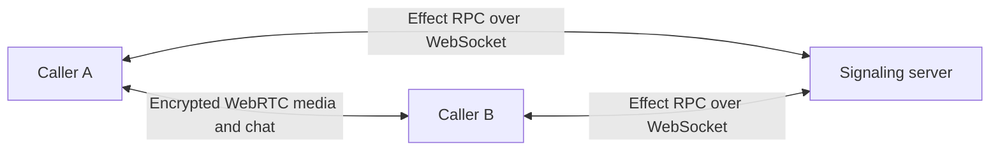
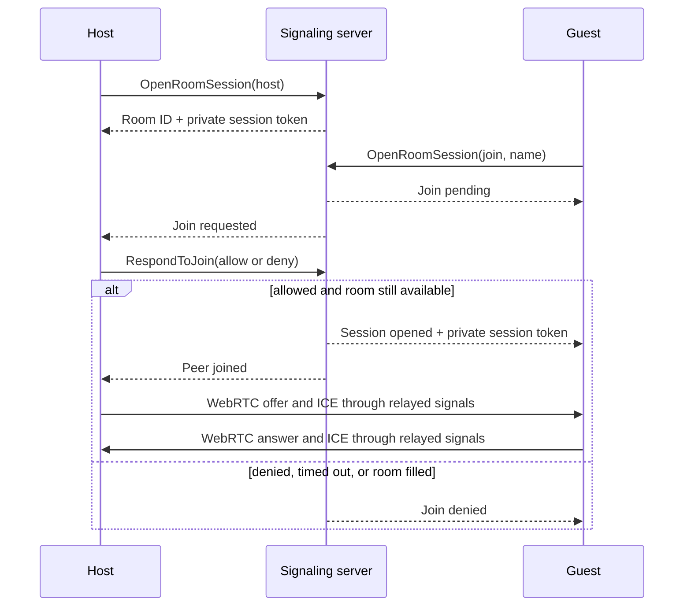

<p align="center">
  
</p>

<h1 align="center">Tether</h1>

<p align="center">
  Private, account-free video calls with host-controlled admission.
  <br />
  Peer-to-peer media, ephemeral chat, and a safety code you can verify aloud.
</p>

<p align="center">
  <a href="https://tether.nikhilsnayak.dev"><strong>Open Tether</strong></a>
  ·
  <a href="https://github.com/nikhilsnayak/tether/issues">Report an issue</a>
</p>

<p align="center">
  <a href="https://github.com/nikhilsnayak/tether/actions/workflows/ci.yml"></a>
  <a href="LICENSE"></a>
</p>

> [!NOTE]
> Tether is a production beta. The hosted web application supports real cross-network calls.
> The Android client has reached feature parity and is distributed as an Expo development build
> while it is validated for release. A desktop client reuses the web app inside an Electron shell
> and is currently packaged for Linux.

## Features

- **Private rooms for two.** Create a short room code and share its invite link without creating an account. Guests enter a display name and knock; the host explicitly allows or denies each request before any WebRTC negotiation begins.
- **A shared Dusk Suite.** Web and desktop callers enter a responsive procedural 3D room, wait outside until admitted, and each control their own visible avatar. Camera feeds stay in separate draggable tiles while the room display remains ready for future watch-along work.
- **Web, Android, and desktop clients.** The same room works from a browser, the native Android app, or the Electron desktop app. Shared room links open directly in the installed app — Android App Links on mobile, and on desktop the web page hands off to the app through its `tether://` deep link.
- **Peer-to-peer video and audio.** Camera and microphone media use WebRTC, with separate self/remote video tiles plus in-call mic, camera, speaker, and audio-output controls. Turning a camera off never removes its avatar.
- **Ephemeral chat.** Messages travel over the call's encrypted WebRTC data channel and disappear when the session ends.
- **Verifiable safety codes.** Both callers can compare a code derived from the negotiated DTLS fingerprints to detect signaling-path fingerprint substitution.
- **Resilient sessions.** Tether reconnects failed peer connections, rejects stale events, recovers stalled negotiation, and isolates chat-channel closure without interrupting media or invalidating the safety code.
- **Controlled admission.** Multiple guests may knock concurrently, requests remain visible in arrival order, and unanswered or withdrawn knocks are cleaned up automatically. Only one guest can be admitted to the two-person room.
- **Public STUN discovery.** Calls use Google's public STUN server to establish a direct path.

## Privacy and security

Tether is an experimental project provided as-is, without warranty or any commitment to uptime or support. See the [Terms & Acceptable Use](https://tether.nikhilsnayak.dev/terms) page for the full terms.

Tether separates signaling from call content:

- The signaling server relays room membership, SDP, and ICE messages. It does not receive decoded camera, microphone, or chat content.
- Audio, video, and chat are encrypted by WebRTC and travel directly between callers.
- Rooms and signaling state are held in memory and removed when callers leave. Tether has no account system, call history, or message database.
- Each room admits at most two peers. A guest's display name is an unverified, ephemeral claim shown only to the host while deciding whether to admit them.
- Private session tokens authorize admission decisions, signaling, and leave operations after a caller joins.
- The server validates RPC payloads, rate-limits signaling per member, and caps live rooms.

The safety code is meaningful only when both callers compare it through a separate trusted channel, such as reading it aloud. It does not protect a compromised browser, device, or copy of the client application.

To report abuse, email [nikhilsnayak3473@gmail.com](mailto:nikhilsnayak3473@gmail.com) or [open an issue](https://github.com/nikhilsnayak/tether/issues). Because Tether keeps no call history, reports should include the room code and approximate time; enforcement is limited to forward-looking measures.

## How it works



Admission happens before peer connection setup:



The Bun server exposes an Effect RPC endpoint over WebSocket. A streaming `OpenRoomSession` call represents a host, pending join, or admitted membership and carries the server-to-client event channel. Unary `RespondToJoin`, `SendSignal`, and `LeaveRoom` calls handle admission, WebRTC signaling, and explicit departure.

The room registry is serialized in one in-memory `SynchronizedRef`. Each admitted member—and each pending guest—owns an event queue. Reusing the pending guest's queue after admission ensures that an immediate answer or ICE candidate cannot be lost during the transition from waiting to connected.

Signaling is intentionally single-process and in-memory. Active calls end when the server process restarts or is redeployed, and the room registry only coordinates one live replica at a time. Running multiple replicas requires either shared signaling state or deterministic room affinity. That tradeoff keeps the system ephemeral and simple, and it does not imply that media ever transits the server.

On the client, room events, WebRTC callbacks, timers, and UI commands enter one serialized peer-session actor. That actor owns negotiation state and scoped resources, preventing concurrent callbacks from racing connection state. The implementation is React-free and platform-neutral; the web and mobile apps each supply a thin WebRTC adapter and UI on top of the shared runtime.

Each room also carries an ephemeral template ID. The server retains that ID only with the in-memory
room record; it does not store scene assets. Web and desktop clients resolve the ID against their
bundled template registry and render Dusk Suite locally with React Three Fiber's WebGPU renderer.
The browser gameplay layer reads bounds, obstacles, role spawns, and camera tuning from that
template, so additional rooms can provide different geometry without forking avatar controls.
The room is procedural and makes no runtime requests for third-party models, textures,
environments, fonts, or audio. Android participates in the same room protocol and template
metadata but keeps its existing native call interface.

## Quick start

### Requirements

- [Bun](https://bun.sh/) 1.3.14
- A secure modern browser with WebGL2, WebRTC, and camera/microphone access

```sh
git clone https://github.com/nikhilsnayak/tether.git
cd tether
bun install
cp apps/web/.env.example apps/web/.env
bun run dev --filter=server --filter=web
```

Open `http://localhost:5173` in two tabs. Start a call and complete the media check in the first tab,
then open its invite link in the second, enter a name, and knock. The guest waits outside
the room until the host allows the request; admission starts the peer connection and brings both
callers into the shared room. On web or desktop, use WASD or the arrow keys to move and turn,
R to recenter the third-person camera, drag to orbit, and scroll to zoom. Localhost is treated as a secure browser context, so camera,
microphone, and graphics APIs are available during development.

## Configuration

The default configuration runs locally without additional services.

### Server

| Variable | Default   | Purpose                        |
| -------- | --------- | ------------------------------ |
| `HOST`   | `0.0.0.0` | HTTP server bind address       |
| `PORT`   | `8008`    | HTTP and WebSocket server port |

ICE discovery is fixed to `stun:stun.l.google.com:19302`; there is no server-side ICE
configuration. Calls that cannot establish a direct peer-to-peer path will fail.

### Web

| Variable          | Default                   | Purpose                                          |
| ----------------- | ------------------------- | ------------------------------------------------ |
| `VITE_SERVER_URL` | `ws://localhost:8008/rpc` | Full WebSocket URL of the signaling RPC endpoint |
| `VITE_WEB_URL`    | current web origin        | Base URL used for shareable room links           |

Production browser deployments require HTTPS and a corresponding `wss://` signaling URL for camera and microphone access.

The web room requires WebGL2. React Three Fiber prefers WebGPU when available and falls back to
WebGL2 otherwise; browsers without WebGL2 stop at the compatibility screen before requesting media.
Quality selection and automatic quality reduction are local to each caller; they do not change the
other caller's room.

### Mobile

| Variable                 | Default                                    | Purpose                                          |
| ------------------------ | ------------------------------------------ | ------------------------------------------------ |
| `EXPO_PUBLIC_SERVER_URL` | `wss://tether-server.nikhilsnayak.dev/rpc` | Full WebSocket URL of the signaling RPC endpoint |
| `EXPO_PUBLIC_WEB_URL`    | `https://tether.nikhilsnayak.dev`          | Web origin used for shareable room links         |

The app uses `react-native-webrtc`, so it runs in an Expo development build rather than Expo Go:

```sh
cd apps/mobile
cp .env.example .env
bunx eas-cli build --profile development --platform android
bun run dev
```

Room links open in the app through Android App Links. The web deployment serves the matching
[`assetlinks.json`](apps/web/public/.well-known/assetlinks.json), which must list the SHA-256
fingerprint of the Android signing certificate (`bunx eas-cli credentials -p android`).

### Desktop

The desktop client is an Electron shell that loads the web app's source, so it shares the web
build variables. Both default to the hosted deployment and can be overridden in `apps/desktop/.env`.

| Variable          | Default                                    | Purpose                                          |
| ----------------- | ------------------------------------------ | ------------------------------------------------ |
| `VITE_SERVER_URL` | `wss://tether-server.nikhilsnayak.dev/rpc` | Full WebSocket URL of the signaling RPC endpoint |
| `VITE_WEB_URL`    | `https://tether.nikhilsnayak.dev`          | Web origin used for shareable room links         |

```sh
cd apps/desktop
cp .env.example .env
bun run dev
```

`bun run package` produces an installable Linux `.deb`. Room links (`tether://room/<id>`) open the
installed app and route directly to the room.

## Architecture

Tether is a Bun workspace managed with Turborepo.

```text
apps/
  server/          Bun HTTP server, admission coordinator, and Effect RPC signaling relay
  web/             React 19, Vite, TanStack Router, and browser WebRTC adapter
  mobile/          Expo + react-native-webrtc client on the shared peer-session runtime
  desktop/         Electron shell that reuses the web app and handles tether:// deep links
packages/
  contracts/       Shared Effect Schema models and RPC contracts
  client-runtime/  React-free peer-session actor and platform service interfaces
  ui/              Shared React components and design tokens
e2e/               Playwright browser tests for complete two-peer flows
```

The main implementation boundaries are:

- [`apps/server/src/modules/room`](apps/server/src/modules/room) — the public room service facade plus registry, membership, admission, broadcast, and authenticated-signaling operations.
- [`packages/client-runtime/src/modules/room`](packages/client-runtime/src/modules/room) — React-independent room orchestration, admission events, presentation state, and resource ownership.
- [`packages/client-runtime/src/modules/peer-session`](packages/client-runtime/src/modules/peer-session) — the React-free platform-neutral actor for WebRTC negotiation, reconnection, safety-code derivation, chat, and transport state.
- [`apps/web/src/modules/room`](apps/web/src/modules/room) — browser WebRTC integration and the call interface.
- [`apps/mobile/src/modules/room`](apps/mobile/src/modules/room) — react-native-webrtc integration and the native call interface.
- [`packages/contracts/src/modules/room`](packages/contracts/src/modules/room) — shared wire schemas and RPC definitions.

### Technology

- Effect 4 and Effect RPC
- TypeScript 6
- Bun and Turborepo
- React 19 and Vite
- React Three Fiber 10 and Three.js WebGPU rendering
- TanStack Router
- Expo and React Native
- Tailwind CSS 4
- Vitest and Playwright
- oxlint and oxfmt

## Development

Install the Playwright browser once before running the complete test suite:

```sh
cd e2e
bun x playwright install chromium
cd ..
```

Then run the repository checks from the root:

```sh
bun run lint
bun run fmt:check
bun run test
bun run build
```

Run `bun run test:coverage` to generate unit coverage reports for the server, web, mobile, and
client runtime. CI retains those reports as an artifact.

The test suite covers concurrent and timed-out knocks, admission races, room-capacity invariants,
authenticated signaling, rate limits, STUN configuration, peer-session state transitions, resource
cleanup, safety-code agreement, complete two-peer calls, chat-channel isolation, media controls,
and peer-connection recovery. Coverage thresholds are enforced for the server, web, mobile, and
shared client runtime.

## Roadmap

- Add watch-along media as another negotiated track on the existing connection.

## License

Tether is available under the [MIT License](LICENSE).
