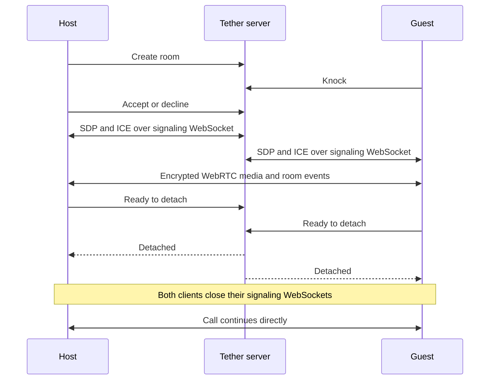

<p align="center">
  
</p>

<h1 align="center">Tether</h1>

<p align="center">
  A private, account-free room for two people.
  <br />
  Talk, chat, and share a small spatial room over a direct peer-to-peer connection.
</p>

<p align="center">
  <a href="https://tether.nikhilsnayak.dev"><strong>Open Tether</strong></a>
  ·
  <a href="https://github.com/nikhilsnayak/tether/issues">Report an issue</a>
</p>

<p align="center">
  <a href="https://github.com/nikhilsnayak/tether/actions/workflows/ci.yml"></a>
  <a href="LICENSE"></a>
</p>

Tether is an experimental two-person calling app. A host creates a short-lived room, shares the
link, and decides whether to admit the person who knocks. Once the WebRTC connection is ready, the
call detaches from Tether's signaling server and continues directly between the two devices.

Web and desktop place both people in a lightweight 3D room. The native app provides the same
admission, calling, and chat flow with a conventional call interface.

## What is available today

- **Private rooms for two.** There are no accounts, contact lists, scheduled meetings, recordings,
  or stored messages.
- **Host-approved entry.** A guest waits outside until the host accepts or declines the knock.
- **Direct audio, video, and room events.** Media, chat, avatar poses, and camera/microphone state
  travel over WebRTC.
- **Detached signaling.** After both peers confirm the current connection is usable, each client
  closes its signaling WebSocket. The web app shows a quiet `Direct` indicator at that point.
- **A shared spatial room on web and desktop.** Each person controls an avatar while camera feeds
  remain in movable utility tiles.
- **Distance-based spatial audio (Chromium).** The remote voice softens as your avatars move apart,
  Watch Together audio softens as you step back from the wall display, and both pan with your view —
  kept above a floor so they never fall silent. Browsers without it keep plain stereo audio and
  output-device selection unchanged.
- **Watch Together on the room display.** A compatible web or desktop peer can select a local video
  and stream it directly to both peers, with shared playback controls in the call dock.
- **Connection safety codes.** Both people can compare a code derived from the negotiated DTLS
  fingerprints to check that they see the same connection.
- **Local connection diagnostics.** When a direct connection cannot be established, each client
  distinguishes missing candidates, blocked STUN discovery, direct-path rejection, and negotiation
  timeout without retaining addresses, SDP, or ICE candidate contents.

## How a call works

The server is involved in finding and admitting a peer, then in exchanging the information WebRTC
needs to connect. It is not kept in the path for the rest of a successful call.



The server exposes two RPC transports:

- `/rpc` uses HTTP for ordinary request/response work such as room metadata.
- `/rpc/signaling` uses WebSocket for ordered admission and WebRTC signaling events. Each peer
  session owns this connection and closes it after detachment.

On the client, WebRTC callbacks, server events, timers, data-channel messages, and UI commands are
serialized through a platform-neutral peer-session actor. Web, desktop, and mobile supply their own
media and WebRTC adapters around that runtime.

The `room-events-v1` data channel carries bounded, schema-validated events for chat, avatar poses,
media state, detachment coordination, and departure. Pose updates are rate-limited so they cannot
build an unbounded queue.

Rooms that support Watch Together also negotiate reserved program-audio and program-video
transceivers plus a dedicated `watch-control-v1` data channel before detachment. Starting a video
later therefore does not reopen signaling or renegotiate the peer connection.

## The room experience

On web and desktop, callers meet as two procedural avatars in the Dusk Suite. Each browser owns its
local avatar and receives the other person's pose over the data channel. Movement stays within the
room, and the avatars act as soft obstacles to each other.

On Chromium, sound is spatial: the other person's voice and any shared video soften as your avatars
move apart or as you step back from the wall display, and pan with your view, so distance in the
room is something you can hear. A floor keeps sources quiet-but-audible rather than ever silent, and
output-device selection, volume, and speaker mute continue to work. Other browsers fall back to
plain stereo playback with the same controls.

Video remains separate from the avatars in two draggable tiles. Turning a camera off changes the
tile to a placeholder without removing the avatar. In rooms with Watch Together, the wall display
shows a local video selected by either compatible peer. Open **Watch** in the bottom call dock to
choose a file or use the shared play, pause, replay, and Stop controls. The file is decoded on the
presenter's device and sent as live WebRTC program media; it is not uploaded to Tether.

Movement follows familiar third-person controls: input is relative to the camera, the avatar turns
toward the direction of travel, and orbiting does not rotate the avatar. The camera shortens its
boom near room boundaries while retaining enough clearance to avoid entering the avatar.

| Input         | Action                                |
| ------------- | ------------------------------------- |
| W / Up        | Move forward relative to the camera   |
| S / Down      | Move backward relative to the camera  |
| A / Left      | Move left relative to the camera      |
| D / Right     | Move right relative to the camera     |
| R             | Recenter behind the avatar            |
| Pointer drag  | Orbit independently around the avatar |
| Wheel / pinch | Zoom                                  |

Touch browsers also receive on-screen movement controls. Rendering quality can be selected
manually or left on automatic, which lowers quality after a sustained frame-rate drop.

## Platform status

| Platform | Status                                                                                                          |
| -------- | --------------------------------------------------------------------------------------------------------------- |
| Web      | Spatial room and spatial audio, admission, calls, chat, safety codes, media controls, and Watch Together        |
| Desktop  | Electron shell around the web app, including Watch Together, Linux `.deb` packaging, and `tether://` room links |
| Mobile   | Native admission, audio/video, chat, deep links, and receive-only Watch Together playback and controls          |

## Privacy and current limits

Tether keeps call content separate from coordination:

- The server handles room membership, admission, SDP, ICE, and detachment readiness.
- Voice/video media, Watch Together program media, chat, avatar poses, and media state are
  encrypted by WebRTC and sent between peers.
- Rooms, pending knocks, and signaling state live only in server memory. There is no account,
  message, recording, or call-history database.
- Private session tokens authorize admission decisions, signaling, and departure.
- RPC payloads are schema-validated. The server rate-limits signaling and caps live rooms.
- A guest's display name is an unverified, temporary claim shown during admission.

Detachment is intentionally one-way. After a call becomes direct, the room cannot admit a
replacement peer and the server cannot reconnect the call if the peer-to-peer connection later
fails. Either person leaving is communicated over the existing data channel.

The safety code is useful only when both people compare it over a separate trusted channel, such as
reading it aloud. It does not protect a compromised browser, device, or client build.

Tether intentionally uses Google's public STUN service only for address discovery and will not use
or provide a TURN relay. Call content is never routed through a media relay: if both networks do not
permit a direct WebRTC path, the call fails. This privacy constraint deliberately trades connection
coverage for a strictly peer-to-peer content path. Before detachment, signaling is single-process
and in-memory; a server restart ends rooms that are still connecting.

The service is provided as-is, without an uptime commitment. See
[Terms & Acceptable Use](https://tether.nikhilsnayak.dev/terms). To report abuse, email
[nikhilsnayak3473@gmail.com](mailto:nikhilsnayak3473@gmail.com) or
[open an issue](https://github.com/nikhilsnayak/tether/issues).

## Run locally

### Requirements

- [Bun](https://bun.sh/) 1.3.14
- A modern browser with WebGL2, WebRTC, and camera/microphone access. Presenting a local Watch
  Together file additionally requires `HTMLMediaElement.captureStream()`; peers without it can
  still receive and control a shared video.

```sh
git clone https://github.com/nikhilsnayak/tether.git
cd tether
bun install
cp apps/web/.env.example apps/web/.env
bun run dev --filter=server --filter=web
```

Open `http://localhost:5173` in two tabs or browsers. Create a room in the first, open its invite in
the second, and knock. Localhost is treated as a secure context for browser media and graphics APIs.

No database, object storage, or additional local service is required.

## Configuration

### Server

| Variable | Default   | Purpose                        |
| -------- | --------- | ------------------------------ |
| `HOST`   | `0.0.0.0` | HTTP server bind address       |
| `PORT`   | `8008`    | HTTP and WebSocket server port |

ICE discovery uses the fixed STUN endpoint `stun:stun.l.google.com:19302`. This is intentionally
limited to STUN: Tether does not accept TURN configuration or fall back to a media relay.

### Web and desktop

| Variable          | Default                        | Purpose                             |
| ----------------- | ------------------------------ | ----------------------------------- |
| `VITE_SERVER_URL` | `http://localhost:8008` on web | HTTP(S) origin of the Tether server |
| `VITE_WEB_URL`    | Current web origin             | Base URL used for room invitations  |

Clients derive HTTP `/rpc` and WebSocket `/rpc/signaling` endpoints from `VITE_SERVER_URL`.
Production therefore uses an `https://` server origin; the client derives `wss://` for signaling.

Desktop reuses the web renderer. Its checked-in example points to the hosted service and can be
overridden in `apps/desktop/.env`.

```sh
cd apps/desktop
cp .env.example .env
bun run dev
```

`bun run package` creates a Linux `.deb`. Installed builds handle `tether://room/<id>` links.

### Mobile

| Variable                 | Default                                  | Purpose                              |
| ------------------------ | ---------------------------------------- | ------------------------------------ |
| `EXPO_PUBLIC_SERVER_URL` | `https://tether-server.nikhilsnayak.dev` | HTTP(S) origin of the Tether server  |
| `EXPO_PUBLIC_WEB_URL`    | `https://tether.nikhilsnayak.dev`        | Web origin used for room invitations |

The app uses `react-native-webrtc`, so it needs an Expo development build rather than Expo Go:

```sh
cd apps/mobile
cp .env.example .env
bunx eas-cli build --profile development --platform android
bun run dev
```

Android App Links use
[`apps/web/public/.well-known/assetlinks.json`](apps/web/public/.well-known/assetlinks.json), which
must contain the SHA-256 fingerprint of the signing certificate.

## Repository layout

Tether is a Bun workspace managed with Turborepo.

```text
apps/
  server/          In-memory admission coordinator and signaling server
  web/             Spatial room, browser WebRTC adapter, and web interface
  desktop/         Electron shell, Linux packaging, and protocol links
  mobile/          Expo call client using react-native-webrtc
packages/
  contracts/       Shared Effect Schema models and RPC contracts
  client-runtime/  Platform-neutral room and peer-session actors
  ui/              Shared React components and design tokens
  test-support/    Shared peer-session platform contract tests
e2e/               Playwright tests for complete two-browser flows
```

The main module boundaries are:

- [`apps/server/src/modules/room`](apps/server/src/modules/room) — membership, admission,
  signaling, detachment, and event delivery.
- [`packages/contracts/src/modules/room`](packages/contracts/src/modules/room) — client/server RPC
  and event schemas.
- [`packages/client-runtime/src/modules/room`](packages/client-runtime/src/modules/room) — room
  orchestration and presentation state.
- [`packages/client-runtime/src/modules/peer-session`](packages/client-runtime/src/modules/peer-session)
  — WebRTC negotiation, recovery, safety codes, detachment, room events, and watch supervision.
- [`packages/client-runtime/src/modules/watch-along`](packages/client-runtime/src/modules/watch-along)
  — shared playback protocol, actor, supervision boundary, and view projections.
- [`apps/web/src/modules/room`](apps/web/src/modules/room) — browser media, call UI, and the Dusk
  Suite.
- [`apps/mobile/src/modules/room`](apps/mobile/src/modules/room) — native media adapter and call UI.

### Technology

Effect 4 and Effect RPC · TypeScript 6 · Bun · Turborepo · React 19 · Vite · TanStack Router ·
React Three Fiber · Three.js · Electron · Expo · React Native · Tailwind CSS 4 · Vitest ·
Playwright · oxlint · oxfmt

## Development and verification

The common repository checks run from the root:

```sh
bun run test:unit
bun run lint
bun run fmt:check
bun run test:coverage
bun run build
```

Install Chromium once before browser tests:

```sh
cd e2e
bunx playwright install chromium
cd ..
```

Then run the Playwright suite:

```sh
bun run test:e2e
```

The suite is a single core-journey test: two peers complete media setup, admit, connect over
WebRTC, exchange real audio/video in the production React Three Fiber room, confirm the safety
code, exchange a chat message across the data channel, and leave. It mounts the real canvas and
frame loop under SwiftShader in CI, so one run covers the app's critical end-to-end path.

## Deliberate scope

The current product is limited to two people, one procedural room, ground-plane movement, and
ephemeral content. TURN relaying is permanently excluded so call content always travels directly
between the two peers. The current scope also excludes accounts, persistent rooms, avatar
customization, object interaction, native 3D rendering, and multi-person calls.

## License

Tether is available under the [MIT License](LICENSE).
