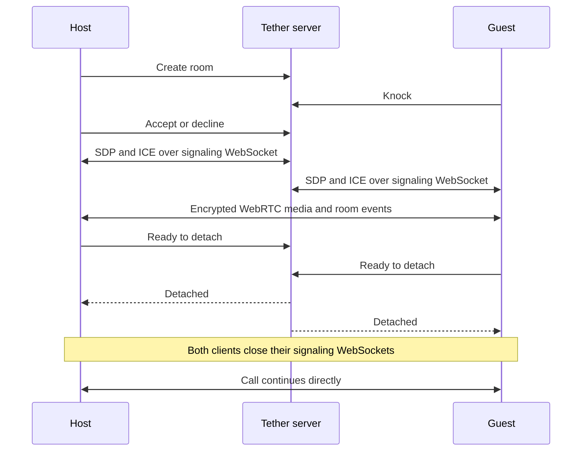

<p align="center">
  
</p>

<h1 align="center">Tether</h1>

<p align="center">
  A private, account-free room for two people.
  <br />
  Talk, chat, and share a small spatial room over a direct peer-to-peer connection.
</p>

<p align="center">
  <a href="https://tether.nikhilsnayak.dev"><strong>Open Tether</strong></a>
  ·
  <a href="https://github.com/nikhilsnayak/tether/issues">Report an issue</a>
</p>

<p align="center">
  <a href="https://github.com/nikhilsnayak/tether/actions/workflows/ci.yml"></a>
  <a href="LICENSE"></a>
</p>

Tether is an experimental two-person calling app. A host creates a short-lived room, shares the
link, and decides whether to admit the person who knocks. Once the WebRTC connection is ready, the
call detaches from Tether's signaling server and continues directly between the two devices.

Web and desktop place both people in a lightweight 3D room. The native app provides the same
admission, calling, and chat flow with a conventional call interface.

## What is available today

- **Private rooms for two.** There are no accounts, contact lists, scheduled meetings, recordings,
  or stored messages.
- **Host-approved entry.** A guest waits outside until the host accepts or declines the knock.
- **Direct audio, video, and room events.** Media, chat, avatar poses, and camera/microphone state
  travel over WebRTC.
- **Detached signaling.** After both peers confirm the current connection is usable, each client
  closes its signaling WebSocket. The web app shows a quiet `Direct` indicator at that point.
- **A shared spatial room on web and desktop.** Each person controls an avatar while camera feeds
  remain in movable utility tiles.
- **Connection safety codes.** Both people can compare a code derived from the negotiated DTLS
  fingerprints to check that they see the same connection.

## How a call works

The server is involved in finding and admitting a peer, then in exchanging the information WebRTC
needs to connect. It is not kept in the path for the rest of a successful call.



The server exposes two RPC transports:

- `/rpc` uses HTTP for ordinary request/response work such as room metadata.
- `/rpc/signaling` uses WebSocket for ordered admission and WebRTC signaling events. Each peer
  session owns this connection and closes it after detachment.

On the client, WebRTC callbacks, server events, timers, data-channel messages, and UI commands are
serialized through a platform-neutral peer-session actor. Web, desktop, and mobile supply their own
media and WebRTC adapters around that runtime.

The `room-events-v1` data channel carries bounded, schema-validated events for chat, avatar poses,
media state, detachment coordination, and departure. Pose updates are rate-limited so they cannot
build an unbounded queue.

## The room experience

On web and desktop, callers meet as two procedural avatars in the Dusk Suite. Each browser owns its
local avatar and receives the other person's pose over the data channel. Movement stays within the
room, and the avatars act as soft obstacles to each other.

Video remains separate from the avatars in two draggable tiles. Turning a camera off changes the
tile to a placeholder without removing the avatar. The wall display is currently idle and reserved
for a future shared activity.

| Input         | Action              |
| ------------- | ------------------- |
| W / Up        | Walk forward        |
| S / Down      | Walk backward       |
| A / Left      | Turn left           |
| D / Right     | Turn right          |
| R             | Recenter the camera |
| Pointer drag  | Orbit the camera    |
| Wheel / pinch | Zoom                |

Touch browsers also receive on-screen movement controls. Rendering quality can be selected
manually or left on automatic, which lowers quality after a sustained frame-rate drop.

## Platform status

| Platform | Status                                                                                      |
| -------- | ------------------------------------------------------------------------------------------- |
| Web      | Full spatial room, admission, audio/video, chat, safety codes, and media controls           |
| Desktop  | Electron shell around the web app, Linux `.deb` packaging, and `tether://` room links       |
| Mobile   | Expo development build with native admission, audio/video, chat, and deep links; no 3D room |

## Privacy and current limits

Tether keeps call content separate from coordination:

- The server handles room membership, admission, SDP, ICE, and detachment readiness.
- Audio, video, chat, avatar poses, and media state are encrypted by WebRTC and sent between peers.
- Rooms, pending knocks, and signaling state live only in server memory. There is no account,
  message, recording, or call-history database.
- Private session tokens authorize admission decisions, signaling, and departure.
- RPC payloads are schema-validated. The server rate-limits signaling and caps live rooms.
- A guest's display name is an unverified, temporary claim shown during admission.

Detachment is intentionally one-way. After a call becomes direct, the room cannot admit a
replacement peer and the server cannot reconnect the call if the peer-to-peer connection later
fails. Either person leaving is communicated over the existing data channel.

The safety code is useful only when both people compare it over a separate trusted channel, such as
reading it aloud. It does not protect a compromised browser, device, or client build.

Tether currently uses Google's public STUN service and does not provide a TURN relay. Calls work
only when both networks permit a direct WebRTC path. Before detachment, signaling is single-process
and in-memory; a server restart ends rooms that are still connecting.

The service is provided as-is, without an uptime commitment. See
[Terms & Acceptable Use](https://tether.nikhilsnayak.dev/terms). To report abuse, email
[nikhilsnayak3473@gmail.com](mailto:nikhilsnayak3473@gmail.com) or
[open an issue](https://github.com/nikhilsnayak/tether/issues).

## Run locally

### Requirements

- [Bun](https://bun.sh/) 1.3.14
- A modern browser with WebGL2, WebRTC, and camera/microphone access

```sh
git clone https://github.com/nikhilsnayak/tether.git
cd tether
bun install
cp apps/web/.env.example apps/web/.env
bun run dev --filter=server --filter=web
```

Open `http://localhost:5173` in two tabs or browsers. Create a room in the first, open its invite in
the second, and knock. Localhost is treated as a secure context for browser media and graphics APIs.

No database, object storage, or additional local service is required.

## Configuration

### Server

| Variable | Default   | Purpose                        |
| -------- | --------- | ------------------------------ |
| `HOST`   | `0.0.0.0` | HTTP server bind address       |
| `PORT`   | `8008`    | HTTP and WebSocket server port |

ICE discovery currently uses `stun:stun.l.google.com:19302`. The ICE server list is not yet
configurable.

### Web and desktop

| Variable          | Default                        | Purpose                             |
| ----------------- | ------------------------------ | ----------------------------------- |
| `VITE_SERVER_URL` | `http://localhost:8008` on web | HTTP(S) origin of the Tether server |
| `VITE_WEB_URL`    | Current web origin             | Base URL used for room invitations  |

Clients derive HTTP `/rpc` and WebSocket `/rpc/signaling` endpoints from `VITE_SERVER_URL`.
Production therefore uses an `https://` server origin; the client derives `wss://` for signaling.

Desktop reuses the web renderer. Its checked-in example points to the hosted service and can be
overridden in `apps/desktop/.env`.

```sh
cd apps/desktop
cp .env.example .env
bun run dev
```

`bun run package` creates a Linux `.deb`. Installed builds handle `tether://room/<id>` links.

### Mobile

| Variable                 | Default                                  | Purpose                              |
| ------------------------ | ---------------------------------------- | ------------------------------------ |
| `EXPO_PUBLIC_SERVER_URL` | `https://tether-server.nikhilsnayak.dev` | HTTP(S) origin of the Tether server  |
| `EXPO_PUBLIC_WEB_URL`    | `https://tether.nikhilsnayak.dev`        | Web origin used for room invitations |

The app uses `react-native-webrtc`, so it needs an Expo development build rather than Expo Go:

```sh
cd apps/mobile
cp .env.example .env
bunx eas-cli build --profile development --platform android
bun run dev
```

Android App Links use
[`apps/web/public/.well-known/assetlinks.json`](apps/web/public/.well-known/assetlinks.json), which
must contain the SHA-256 fingerprint of the signing certificate.

## Repository layout

Tether is a Bun workspace managed with Turborepo.

```text
apps/
  server/          In-memory admission coordinator and signaling server
  web/             Spatial room, browser WebRTC adapter, and web interface
  desktop/         Electron shell, Linux packaging, and protocol links
  mobile/          Expo call client using react-native-webrtc
packages/
  contracts/       Shared Effect Schema models and RPC contracts
  client-runtime/  Platform-neutral room and peer-session actors
  ui/              Shared React components and design tokens
  test-support/    Shared peer-session platform contract tests
e2e/               Playwright tests for complete two-browser flows
```

The main module boundaries are:

- [`apps/server/src/modules/room`](apps/server/src/modules/room) — membership, admission,
  signaling, detachment, and event delivery.
- [`packages/contracts/src/modules/room`](packages/contracts/src/modules/room) — client/server RPC
  and event schemas.
- [`packages/client-runtime/src/modules/room`](packages/client-runtime/src/modules/room) — room
  orchestration and presentation state.
- [`packages/client-runtime/src/modules/peer-session`](packages/client-runtime/src/modules/peer-session)
  — WebRTC negotiation, recovery, safety codes, detachment, and room events.
- [`apps/web/src/modules/room`](apps/web/src/modules/room) — browser media, call UI, and the Dusk
  Suite.
- [`apps/mobile/src/modules/room`](apps/mobile/src/modules/room) — native media adapter and call UI.

### Technology

Effect 4 and Effect RPC · TypeScript 6 · Bun · Turborepo · React 19 · Vite · TanStack Router ·
React Three Fiber · Three.js · Electron · Expo · React Native · Tailwind CSS 4 · Vitest ·
Playwright · oxlint · oxfmt

## Development and verification

The common repository checks run from the root:

```sh
bun run test:unit
bun run lint
bun run fmt:check
bun run test:coverage
bun run build
```

Install Chromium once before browser tests:

```sh
cd e2e
bunx playwright install chromium
cd ..
```

Then run the relevant Playwright lane:

```sh
bun run test:e2e:fast
bun run test:e2e:real-render:smoke
bun run test:e2e:gpu
```

The fast lane covers flows that do not enter the rendered room. Real-render lanes mount the
production React Three Fiber canvas and frame loop. The browser suite covers admission, media,
chat, safety-code agreement, connection recovery, physical signaling-socket closure, direct-call
departure, and complete two-peer room journeys.

## Deliberate scope

The current product is limited to two people, one procedural room, ground-plane movement, and
ephemeral content. It does not yet include TURN relaying, accounts, persistent rooms, avatar
customization, positional audio, object interaction, native 3D rendering, or multi-person calls.

## License

Tether is available under the [MIT License](LICENSE).
