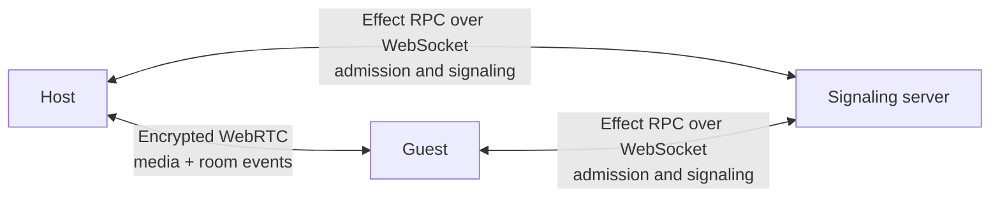
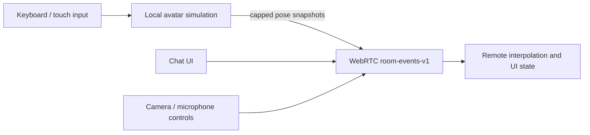
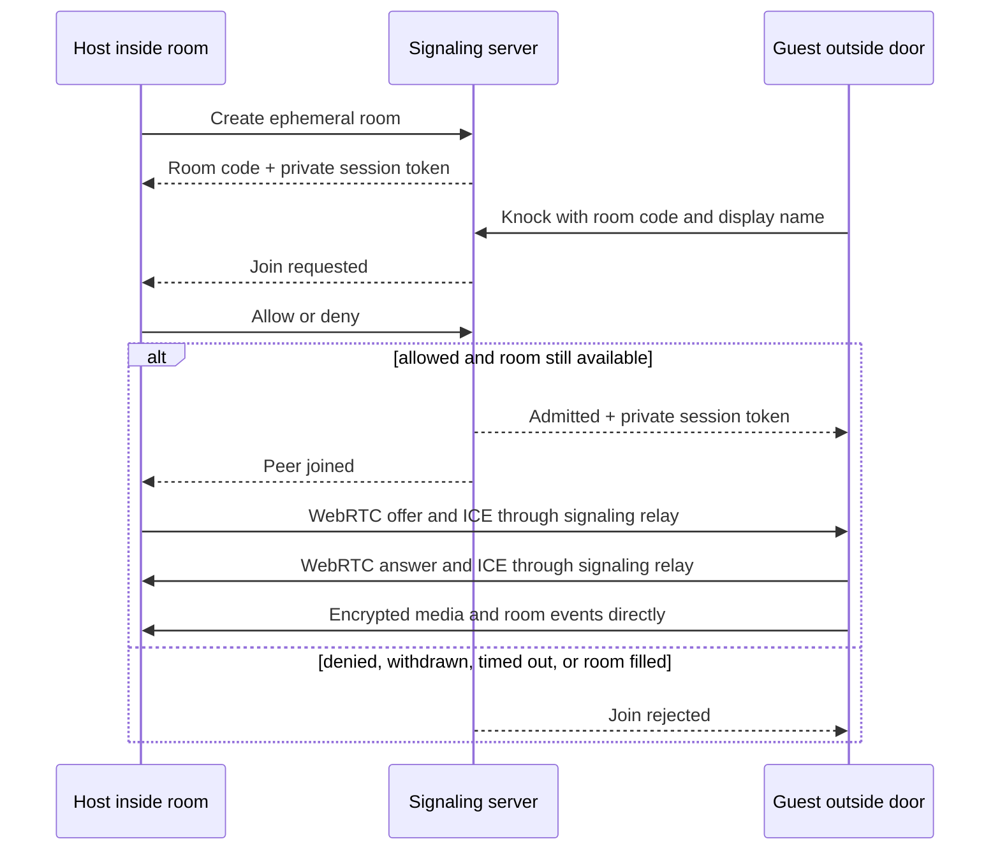

<p align="center">
  
</p>

<h1 align="center">Tether</h1>

<p align="center">
  A private, account-free room for two people.
  <br />
  Meet as avatars in a shared space while video, audio, and chat stay direct between peers.
</p>

<p align="center">
  <a href="https://tether.nikhilsnayak.dev"><strong>Enter Tether</strong></a>
  ·
  <a href="https://github.com/nikhilsnayak/tether/issues">Report an issue</a>
</p>

<p align="center">
  <a href="https://github.com/nikhilsnayak/tether/actions/workflows/ci.yml"></a>
  <a href="LICENSE"></a>
</p>

> [!NOTE]
> Tether is an experimental production beta. Web and desktop provide the full spatial-room
> experience. The Android development build uses the same room, admission, WebRTC, and chat
> foundations with a native call interface; it does not currently render or control the 3D room.

## What Tether is

Tether is a private social room, not a conference grid. A host creates one short-lived room and
shares its code with one other person. The guest arrives outside a closed door and must knock.
Only after the host allows them does the door open, the peer connection begin, and both people
appear inside the same room.

On web and desktop, each caller owns a visible avatar and moves only that avatar. Video is still
available, but it lives in two draggable utility tiles instead of replacing the people or taking
over the room. The wall display is deliberately idle groundwork for future shared activities.

There are no accounts, contact lists, meetings, recordings, or stored messages. The signaling
server coordinates admission and connection setup; live media and room activity use WebRTC
between the two callers.

## Current experience

- **A real admission threshold.** A guest waits outside the same closed room until the host
  explicitly allows or denies the knock. Denial, reconnecting, and transport negotiation do not
  open the door.
- **Two peer-owned avatars.** Both callers have lightweight procedural bodies in Dusk Suite. Each
  browser controls its own position and observes the other peer's synchronized pose. Movement is
  bounded by the room and avatars behave as soft obstacles to one another.
- **Third-person room controls.** Use WASD or the arrow keys to move and turn, drag to orbit, scroll
  or pinch to zoom, and press R to recenter. Touch browsers receive accessible on-screen controls.
- **Video as a utility, not an identity.** Local and remote camera feeds remain separate draggable
  tiles. Turning a camera off changes its tile to a placeholder but leaves the corresponding avatar
  in the room.
- **Direct room events.** Chat, avatar poses, and explicit camera/microphone state share one bounded,
  ordered WebRTC data channel. Pose traffic is rate-limited so it cannot build an unbounded queue.
- **Host-controlled rooms for two.** Multiple people may knock, but the host can admit only one
  guest. Pending and withdrawn requests are cleaned up automatically.
- **Verifiable safety codes.** Both callers can compare a code derived from the negotiated DTLS
  fingerprints to detect signaling-path fingerprint substitution.
- **Resilient peer sessions.** Tether rejects stale signaling, recovers failed negotiations, freezes
  remote spatial state during reconnect, and keeps media independent from room-event channel loss.
- **Local rendering quality.** Each web/desktop caller can choose a quality tier, with automatic
  quality reduction when sustained frame rate drops.

## Platform status

| Platform | Current experience                                                                                                 |
| -------- | ------------------------------------------------------------------------------------------------------------------ |
| Web      | Full Dusk Suite, two avatars, movement, draggable video tiles, chat, admission, and media controls                 |
| Desktop  | Electron shell around the web experience, Linux packaging, and `tether://` room links                              |
| Android  | Expo development build with native admission, WebRTC media, chat, and Android App Links; no 3D avatar gameplay yet |

## Privacy, security, and limits

Tether separates coordination from call content:

- The server relays room membership, admission, SDP, and ICE signaling. It does not receive decoded
  camera, microphone, chat, avatar-pose, or media-state content.
- Audio, video, chat, avatar poses, and media state are encrypted by WebRTC and travel between the
  two callers.
- Rooms, pending knocks, and signaling state live in server memory and disappear when members leave
  or the server restarts. There is no account, message, or call-history database.
- Private session tokens authorize admission decisions, signaling, and departure after a caller
  opens a room session.
- The server validates RPC payloads, rate-limits signaling per member, and caps live rooms.
- A guest's display name is an unverified, ephemeral claim shown to the host during admission.

The safety code helps only when both callers compare it over a separate trusted channel, such as
reading it aloud. It cannot protect a compromised browser, device, or client build.

Tether currently uses Google's public STUN service and has no TURN relay. Calls succeed only when
the two networks permit a direct WebRTC path. Signaling is single-process and in-memory, so active
rooms end on server restart and multiple server replicas require shared state or deterministic room
affinity.

Tether is provided as-is without a warranty or uptime commitment. See
[Terms & Acceptable Use](https://tether.nikhilsnayak.dev/terms). To report abuse, email
[nikhilsnayak3473@gmail.com](mailto:nikhilsnayak3473@gmail.com) or
[open an issue](https://github.com/nikhilsnayak/tether/issues). Include the room code and an
approximate time; because Tether stores no call history, enforcement is necessarily forward-looking.

## How it works



The signaling server never decides where an avatar is or transports call content. After admission,
each client owns its local media and avatar state. A serialized peer-session actor negotiates the
connection and carries three types of room events over `room-events-v1`:



Admission remains a server-authorized transition before WebRTC setup:



The Bun server exposes Effect RPC over WebSocket. Its in-memory room registry is serialized through
one `SynchronizedRef`, and every host, admitted member, and pending guest owns an event queue. The
pending guest's queue is reused at admission so immediate signaling cannot be lost during the
waiting-to-connected transition.

On the client, server events, WebRTC callbacks, timers, data-channel messages, and UI commands enter
one React-free, platform-neutral peer-session actor. Web, desktop, and mobile provide thin platform
adapters around that runtime.

Every room carries an ephemeral template ID. Web and desktop resolve it against a bundled registry
and render Dusk Suite locally using React Three Fiber and Three.js. Geometry, lighting, camera
tuning, walkable bounds, role spawns, and avatars are procedural; no model or environment asset is
fetched at runtime.

## Quick start

### Requirements

- [Bun](https://bun.sh/) 1.3.14
- A modern browser with WebGL2, WebRTC, and camera/microphone access

```sh
git clone https://github.com/nikhilsnayak/tether.git
cd tether
bun install
cp apps/web/.env.example apps/web/.env
bun run dev --filter=server --filter=web
```

Open `http://localhost:5173` in two tabs or browsers. Create a room and complete media setup in the
first, then open its invite in the second and knock. The guest stays outside until the host allows
the request. Localhost counts as a secure browser context for media and graphics APIs.

Once inside on web/desktop:

| Input         | Action              |
| ------------- | ------------------- |
| W / Up        | Walk forward        |
| S / Down      | Walk backward       |
| A / Left      | Turn left           |
| D / Right     | Turn right          |
| R             | Recenter the camera |
| Pointer drag  | Orbit the camera    |
| Wheel / pinch | Zoom                |

## Configuration

The local setup needs no database, object storage, or additional service.

### Server

| Variable | Default   | Purpose                        |
| -------- | --------- | ------------------------------ |
| `HOST`   | `0.0.0.0` | HTTP server bind address       |
| `PORT`   | `8008`    | HTTP and WebSocket server port |

ICE discovery is fixed to `stun:stun.l.google.com:19302`. There is currently no configurable TURN
service or server-side ICE list.

### Web

| Variable          | Default                   | Purpose                           |
| ----------------- | ------------------------- | --------------------------------- |
| `VITE_SERVER_URL` | `ws://localhost:8008/rpc` | Signaling RPC WebSocket URL       |
| `VITE_WEB_URL`    | current web origin        | Base URL for shareable room links |

Production deployments require HTTPS and a matching `wss://` signaling URL. The room requires
WebGL2; Three.js uses WebGPU when available and falls back to WebGL2. Unsupported browsers stop at a
compatibility screen before media setup.

### Desktop

Desktop reuses the web renderer and accepts the same build variables. Its checked-in example points
at the hosted deployment and can be overridden in `apps/desktop/.env`.

```sh
cd apps/desktop
cp .env.example .env
bun run dev
```

`bun run package` creates a Linux `.deb`. Installed builds handle `tether://room/<id>` deep links.

### Android

| Variable                 | Default                                    | Purpose                        |
| ------------------------ | ------------------------------------------ | ------------------------------ |
| `EXPO_PUBLIC_SERVER_URL` | `wss://tether-server.nikhilsnayak.dev/rpc` | Signaling RPC WebSocket URL    |
| `EXPO_PUBLIC_WEB_URL`    | `https://tether.nikhilsnayak.dev`          | Web origin for shareable links |

The app uses `react-native-webrtc`, so it requires an Expo development build rather than Expo Go:

```sh
cd apps/mobile
cp .env.example .env
bunx eas-cli build --profile development --platform android
bun run dev
```

Android App Links use
[`apps/web/public/.well-known/assetlinks.json`](apps/web/public/.well-known/assetlinks.json), which
must contain the SHA-256 fingerprint of the Android signing certificate.

## Repository structure

Tether is a Bun workspace managed with Turborepo.

```text
apps/
  server/          In-memory admission coordinator and Effect RPC signaling relay
  web/             Spatial room, browser WebRTC adapter, and call interface
  desktop/         Electron shell, Linux packaging, and tether:// deep links
  mobile/          Expo native call client using react-native-webrtc
packages/
  contracts/       Shared Effect Schema wire models and RPC contracts
  client-runtime/  React-free room and peer-session actors
  ui/              Shared React components and design tokens
e2e/               Playwright tests for complete two-browser flows
```

Important boundaries:

- [`apps/server/src/modules/room`](apps/server/src/modules/room) — room registry, membership,
  admission, event delivery, and authenticated signaling.
- [`packages/contracts/src/modules/room`](packages/contracts/src/modules/room) — shared RPC and event
  schemas.
- [`packages/client-runtime/src/modules/room`](packages/client-runtime/src/modules/room) —
  platform-neutral room orchestration and presentation state.
- [`packages/client-runtime/src/modules/peer-session`](packages/client-runtime/src/modules/peer-session)
  — WebRTC negotiation, reconnection, safety codes, and room-event transport.
- [`apps/web/src/modules/room`](apps/web/src/modules/room) — Dusk Suite gameplay, browser media, and
  call UI.
- [`apps/mobile/src/modules/room`](apps/mobile/src/modules/room) — native media adapter and call UI.

### Technology

- Effect 4 and Effect RPC
- TypeScript 6
- Bun and Turborepo
- React 19, Vite, and TanStack Router
- React Three Fiber and Three.js WebGPU rendering
- Electron
- Expo, React Native, and `react-native-webrtc`
- Tailwind CSS 4 and Motion
- Vitest, Playwright, oxlint, and oxfmt

## Development and verification

Install Chromium once before running browser tests:

```sh
cd e2e
bunx playwright install chromium
cd ..
```

Run the repository gates from the root:

```sh
bun run lint
bun run fmt:check
bun run test
bun run build
```

Run the browser suite separately:

```sh
cd e2e
bunx playwright test
```

`bun run test:coverage` produces coverage reports for the server, web, mobile, contracts, and shared
runtime. The test suite covers admission races, capacity, authenticated signaling, connection
recovery, safety-code agreement, room-event validation, avatar movement and interpolation,
responsive media tiles, focus-safe controls, and full two-browser room flows.

## Deliberate limits and next steps

The current room is intentionally small: two people, one procedural template, ground-plane
movement, no accounts, and no persistent content. It does not yet include avatar customization,
emotes, positional audio, object interaction, native 3D rendering, multi-person rooms, or a TURN
relay.

The wall display is reserved for the next major direction: peer-negotiated watch-along media that
belongs to the room without turning either participant into a video surface.

## License

Tether is available under the [MIT License](LICENSE).
